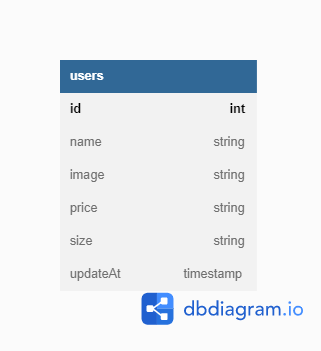

# Car-Management-Dashboard

fsw-Challange-5 Express Mongodb Nodejs
referensi https://www.youtube.com/watch?v=W1Kttu53qTg&ab_channel=DailyTuition

# Sebelum Running

1. Resolusi Layar 1624 X 775px atau seting resolusi broswer
2. instalasi modul= npm i axios body-parser dotenv ejs express mongoose morgan nodemon
   dan buat file config.env dengan isi
   PORT:3000
   MONGO_URL="connection milik kamu"
   contoh: MONGO_URL= mongodb://localhost:27017/Car_Management_Dashboard
3. npm start

# Link

1. Homepage= http://localhost:3000
2. Add-car= http://localhost:3000/add-car
3. Update-car= http://localhost:3000/update-car?id=
4. Delete-car= http://localhost:3000

# End-point

1. menampilkan car GET= http://localhost:3000/api/cars
2. menambahkan car POST= http://localhost:3000/api/cars
3. update car by id PUT= http://localhost:3000/api/cars/:id
4. deleted car by id DELETE= http://localhost:3000/api/cars/:id

# ERD

